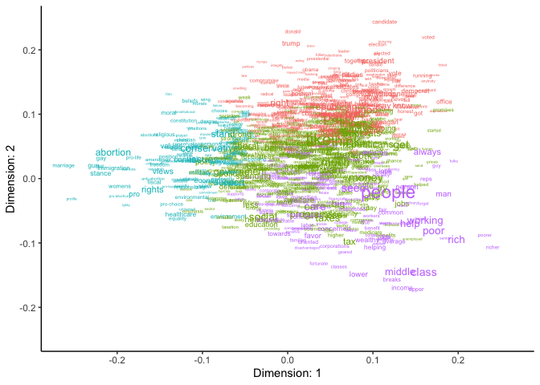

## Example

### install package from github with `devtools`

``` r
library(devtools)
install_github("wilryh/impliedWords", dependencies=TRUE)
```

### load package

``` r
library(impliedWords)
```

### text pre-processing with `stm` package

``` r
library(stm)

processed <- textProcessor(
  input_data$text,
  data.frame(input_data),
  removestopwords=T, lowercase=T, stem=F
)
out <- prepDocuments(
  processed$documents, processed$vocab, processed$meta
)

dtm <- doc_to_dtm(out)
```

### analyze party likes/dislikes responses from the ANES

``` r
data(likes_dislikes_dtm) # included in impliedWords package
data(likes_dislikes_meta)

scores <- scale_text_pcs(
  dtm=likes_dislikes_dtm,
  meta=likes_dislikes_meta,
  weights="weight", # weight and holdout are columns in likes_dislikes_meta
  holdout="holdout",
  max_dimensions = 10
)
#> Loading required package: Matrix
#> Weighting..
#> Counting word co-occurrences..
#> Transforming document-term matrix..
#> Scaling..
```

### list keywords

``` r
get_keywords(
  scores,
  n_dimensions=1,
  n_words = 10
)
```

| keywords (-) | (+) keywords |
|:------------:|:------------:|
|   abortion   |    people    |
|    rights    |     rich     |
|    stance    |     poor     |
|     gun      |    class     |
|     pro      |   working    |
|    views     |     get      |
|    issues    |     help     |
| conservative |    always    |
|   marriage   |     man      |
|     gay      |    middle    |

Dimension 1 keywords

### plot word scores

``` r
plot_keywords(
  scores,
  x_dimension=1, y_dimension=2,
  q_cutoff=0.9,
  color = T
)
```



### score documents

``` r
document_scores <- score_documents_pcs(
  scores=scores
)
```

### label dimensions with AI labels + embeddings

This code is run on a 20% sample to reduce file size for github.

``` r
library(tidyverse)
library(gridExtra)
library(ggwordcloud)


data(likes_dislikes_dtm_sampled)
data(likes_dislikes_meta_with_embeddings_sampled)
data(likes_dislikes_label_embeddings)

scores <- scale_text_pcs(
  dtm=likes_dislikes_dtm_sampled,
  meta=likes_dislikes_meta_with_embeddings_sampled,
  weights="weight", # weight and holdout are columns in likes_dislikes_meta
  holdout="holdout",
  max_dimensions = 10,
  embed_dimensions = T,
  embeddings = "embeddings",
  label_embeddings = likes_dislikes_label_embeddings
)
#> Weighting..
#> Counting word co-occurrences..
#> Transforming document-term matrix..
#> Scaling..
#> Embedding..

get_keywords(
  scores,
  n_dimensions=1,
  n_words = 10
)
#> 
#> 
#> Table: Dimension 1 keywords
#> 
#>  keywords (-)    (+) keywords 
#> --------------  --------------
#>      rich          abortion   
#>     people          rights    
#>      poor           views     
#>     class        conservative 
#>      get             pro      
#>    working           gun      
#>      help           issues    
#>     office       immigration  
#>     always          values    
#>      man           control

plot_labels(
  scores,
  dimension=1
)
```


